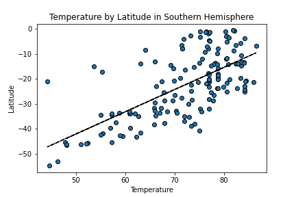
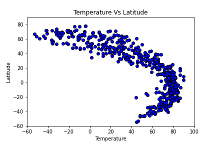
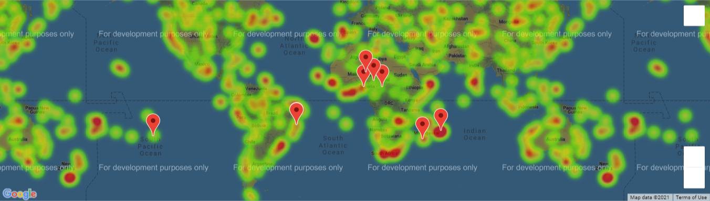
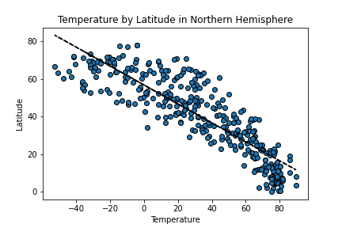

# Weather API

- ## Overview
  - The overall goal of this project is to use Google's APIs to analyze the weather for different cities and determine the ideal vacation spot. To start, visualizations comparing different weather readings and latitude were created for 500 randomly selected cities. An analysis was then completed on these comparative graphs. Then, a heatmap showing the humidity readings was created. This heatmap was used as a backdrop to overlay a few cities and nearby hotels. We narrowed down our list of 500 cities by filtering out cities based on our ideal weather criteria.

  
  - The project consisted of 2 main parts WeatherPy and VacationPy and they're detail as follows:

  - WeatherPy
    - Create a python script to visualize the weather and the distance from the equator for 500 randomly selected cities across the globe.
    - Perform a weather check for each city using the API
    - Plot the following relationships for the entire globe. Run linear regressions for each of the relationships for the Northern and southern hemispheres.
        - Temperature (F) vs. Latitude
        - Humidity (%) vs. Latitude
        - Cloudiness (%) vs. Latitude
        - Wind Speed (mph) vs. Latitude
    - Save CSVs of the data and images of the graphs
  - VacationPy
    - Heat map based on humidity
    - narrow down selections by filtering for your ideal weather conditions
    - use google places api to find the nearest city and hotel for each location
    -  plot hotels on top of heat map with the hotel name, city and country.   

  

- ## Programs, Languages, and Tools
  - [Open Weather Map API](https://openweathermap.org/api)
  - Python
  - Jupyter Notebook
  - Python Libraries:
    - Numpy
    - Pandas
    - Matplotlib
    - Requests
    - Random
    - Citypy
    - CSV
    - OS
    - Gmaps
    - Json
    - Scipy
    - Math

- ## File overview
  - ### WeatherPy.ipynb
    ##### *contains weather analysis code see overview for details*
  - ### VacationPy.ipynb
    ##### *contains location mapping, see overview for details*
  - ### full_country.py
    ##### *contains a python dictionary for country codes and their full names*
  - ### export folders
    ##### *the folders contain the csv files and images generated with the data*

- ## Process
  - ### WeatherPy
    - Step 1: Generate 1500 random coordinate pairs
    - Step 2: For each random coordinate pairs, I found the nearest city using the citipy library. Using each city, I then found the exact latitude and longitude for the city.
    - Step 3:  Removed duplicates based on the city's exact coordinates as to eliminate duplicate cities. 
    - Step 4: Reduced city list to 500 cities
    - Step 5: perform api calls for each city to retrieve the Temperature, Humidity, Cloudiness, Windspeed, and Max Temperature
    - Step 6: Export dataframe to CSV to reduce number of API calls made during development
    - Step 7: Eliminate entries with humidity over 100%
    - Step 8: Define and use function to plot latitude with Temperature, Humidity, Cloudiness, and Windspeed.
    - Step 9: Make 2 separate dataframes for coordinates in the northern and southern hemispheres
    - Step 10: For each hemisphere dataframe, Perform a linear regression and analysis comparing latitude with Temperature, Humidity, Cloudiness, and Windspeed.
    - Step 11: Plot the regression line and scatter plot for each of the 8 relationships
    - Step 12: export the csv files and images of the graphs
  

  - ### VacationPy
    - Step 1 : Import CSV from WeatherPy section into a Pandas dataframe
    - Step 2 : Use coordinates and humidity to create heatmap layer on gmaps figure
    - Step 3 : Apply pandas filters to narrow down the dataframe to cities with our ideal weather
    - Step 4 : Simplify dataframe and use dictionary in full_country.py to fill in the full name of the country
    - Step 5 : Use the latitude and longitude for each city and make api requests to get the nearest hotel to the coordinates
    - Step 6: If the request returns "ZERO RESULTS", this is probably because the location is in the middle of no where. To deal with this, I made an if statement on the status being " ZERO RESULTS"
    - Step 7 : Export the dataframe to CSV to reduce the number of API calls made during development
    - Step 8 : On top of the heatmap, plot pins on all the hotel locations and include the hotel name, city, and country in the info boxes
  

- ## Findings and Conclusion
    - Ultimately, the only factor that significantly correlated with temperature was latitude. Humidity was some what correlated with latitude, but not significantly. All the other factors including cloudiness and wind speed were not correlated
    -  Most of the graphs were not correlated with the exception of the following 2 graphs regarding latitude:

    - 
    - 
  

